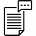
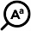
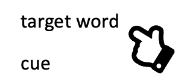
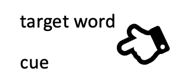

Vocab Victor Zone is based around the concept of _activity types_. These are the different types of activities that your app offers to learners, such as reading a passage or taking a quiz.

Vocabulary knowledge is multi-dimensional (Nation, 2001)
and is acquired imcrementally through multiple exposures and interactions with
words (Dolch 1927). Vocab Victor Zone captures the underpinnings of this process by carefully defining activity types across multiple dimensions.

Each activity type has a set of tags which together provide a linguistic-informed taxonomy of the learner's interaction with a word across multiple dimensions of lexical knowledge. Because Vocab Victor Zone tracks these interactions across multiple dimensions, it can provide a nuanced understanding of the learner's vocabulary acquisition process.

# Global activity types

The following are some of the built-in activity types you can use to log your observations (you can query a complete list using the Activity Types API):

- **Cloze Choose Word in Sentence**: The learner chooses the correct word to fill in the blank in a sentence.
- **MC Choose Translation for Word**: The learner chooses the correct L1 translation for an L2 word.
- **MC Choose Word for Translation**: The learner chooses the correct L2 word for a given L1 translation.
- **Quiz Produce Word from Definition**: The learner produces the target word from a definition.
- **Study Word Definition**: The learner studies the definition of a word.

# Custom activity types

If the activity types in your app do not fit into our predefined categories, you can create custom activity types by defining the unique taxonomy that describes the activity.

Following is a breakdown of the activity type taxonomies. There is some complexity to these types, but never fear:

<Tip>
  _**The Vocab Victor team will help you define custom activity types for your
  app.**_ We will even add new tags to our taxonomy if needed to properly
  capture the unique learning experience in your app.
</Tip>

## Modality

How was the word encountered or produced?

| Value  | Passive                                 | Active                                    | Description                                                  |
| ------ | --------------------------------------- | ----------------------------------------- | ------------------------------------------------------------ |
| text   |  |  | Use when activity involves reading or writing text           |
| speech |    |  | Use when activity involves the learner speaking or listening |
| sign   |    |    | Use when activity interaction is a signed language           |

## Cue Context

In what cue or activity context was the word encountered?

| Value       |                                                       | Description                                                                  |
| ----------- | ----------------------------------------------------- | ---------------------------------------------------------------------------- |
| translation |      | Use when activity involves translation from or to learner’s native language. |
| definition  |    | Use when activity involves a word definition                                 |
| synonym     |          | Use when activity involves a synonym or close match to the word              |
| sentence    |        | Use when activity involves the word in a sentence context                    |
| image       |              | Use when activity interaction involves an image                              |
| association |  | Use when cue has a broad semantic match or is a collocation.                 |
| form_focus  |    | Use when focus of activity is form rather than meaning                       |

## Interaction Types

What type/level level of interaction does the learner have with this word?

| Value   |                                               | Description                                                       |
| ------- | --------------------------------------------- | ----------------------------------------------------------------- |
| match   |      | Learner chooses match for two items.                              |
| trace   |      | The learner traces a word or letters (as in a word search puzzle) |
| produce |  | Use when the learner produces the target word or cue.             |
| study   |      | The learner engages focused attention on the item.                |

## Directionality

It's critical for the activity type to capture the directionality of the activity because passive word knowledge and active word knowledge are different skills.
| Value | | Description |
|-------------|-------------------------------------------------|--------------------|
| active |  | The learner matches or produces the target word. |
| passive |  | The learner matches or produces the cue. |

## Binary Result

| Value | Description                                                                                                                   |
| ----- | ----------------------------------------------------------------------------------------------------------------------------- |
| true  | Use this value if the result of the activity can be correct (1) or incorrect (0), such as answering a question correctly      |
| false | Use this value if there is no "correct response" to the activity, but that it is merely completed, such as a reading activity |

# Taxonomy examples

Here are the tags that make up the taxonomies for the example activity types shown earlier in this page:

- **Cloze Choose Word in Sentence**

  - Modality: text
  - Cue Context: sentence
  - Interaction Type: match
  - Directionality: active (because the target word is chosen)
  - Binary Result: true

- **MC Choose Translation for Word**

  - Modality: text
  - Cue Context: translation
  - Interaction Type: match
  - Directionality: passive (because the cue rather than the target word is chosen)
  - Binary Result: true

- **MC Choose Word for Translation**

  - Modality: text
  - Cue Context: translation
  - Interaction Type: match
  - Directionality: active (because the target word is chosen)
  - Binary Result: true

- **Quiz Produce Word from Definition**

  - Modality: text
  - Cue Context: definition
  - Interaction Type: produce
  - Directionality: active (because the target word is produced)
  - Binary Result: true

- **Study Word Definition**
  - Modality: text
  - Cue Context: definition
  - Interaction Type: study
  - Directionality: passive (because the cue is studied)
  - Binary Result: false
