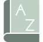

Vocab Victor Zone is based around the concept of _activity types_. These are the different types of activities that your app offers to learners. Activity examples are:

- Reading a passage
- Clicking on a word to see its definition
- Writing a sentence
- Taking a quiz
- Playing a word game

Each activity type has a set of tags which together provide a linguistic-informed taxonomy of the learner's interaction with a word across multiple dimensions of lexical knowledge. Because Vocab Victor Zone tracks these interactions across multiple dimensions, it can provide a nuanced understanding of the learner's vocabulary acquisition process.

Following is a breakdown of the activity type taxonomies. There is some complexity to these types, but never fear:

<Tip>
  _**The Vocab Victor team will help you define activity types for your app.**_
  We will even add new tags to our taxonomy if needed to properly capture the
  unique learning experience in your app.
</Tip>

## Modality

How was the word encountered or produced?

| Value | Passive | Active | Description |
|----------|----------|----------|----------|
| text  |   |   | Use when activity involves reading or writing text  |
| speech  |   |   | Use when activity involves the learner speaking or listening  |
| sign |  | | Use when activity interaction is a signed language |

## Cue Context
In what cue or activity context was the word encountered?

| Value       |          											| Description |
|-------------|-----------------------------------------------------|-------------|
| translation |  	| Use when activity involves translation from or to learner’s native language. |
| definition  |  | Use when activity involves a word definition |
| synonym	  | 		| Use when activity involves a synonym or close match to the word |
| sentence	  | 		| Use when activity involves the word in a sentence context |
| image		  | 			| Use when activity interaction involves an image |
| association |  | Use when cue has a broad semantic match or is a collocation. |
| form_focus  |  | Use when focus of activity is form rather than meaning |

## Interaction Types
What type/level level of interaction does the learner have with this word?

| Value       |          										| Description |
|-------------|-------------------------------------------------|-------------|	
| match		  | 		| Learner chooses match for two items. |
| trace		  | 		| The learner traces a word or letters (as in a word search puzzle) |
| produce	  | 	| Use when the learner produces the target word or cue. |
| study		  | 		| The learner engages focused attention on the item. |

## Directionality
