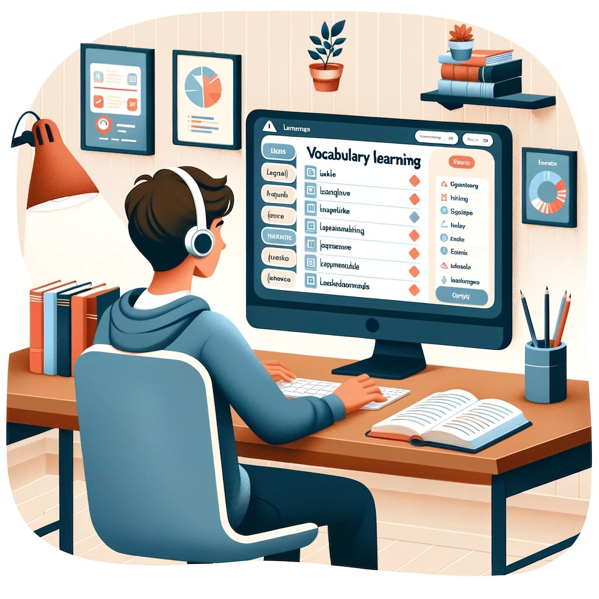

Vocabulary Systems respects your privacy and the privacy of your users. We do not store any personal information about your users. We use your own unique learner ID to track each of your learner's progress. This allows you to leverage the benefit of the learner model without storing any personal information on our system.

# How it works

When you log an observation, you will include your learner's unique ID. This ID is unique to your app and is not shared with any other app. We use this ID to track your learner's progress and provide you with the best words for your learner's next activity.

## The learner dashboard

The Vocab Victor team is developing a learner dashboard which will allow learners to take charge of their own learning process! Learners will be able to see and study their zone words, review and complete assignments from teachers, and see their vocabulary grow over time. They will also be able to hook up the language learning apps they use, so that all their apps will share the same learner model and contribute to one seamless learning journey.

		Vocabulary Systems respects your privacy and the privacy of your users. We do not store any personal information about your users. We use your own unique learner ID to track each of your learner's progress. This allows you to leverage the benefit of the learner model without storing any personal information on our system.
		# How it works
		When you log an observation, you will include your learner's unique ID. This ID is unique to your app and is not shared with any other app. We use this ID to track your learner's progress and provide you with the best words for your learner's next activity.
		## The learner dashboard

	

		The Vocab Victor team is developing a learner dashboard which will allow learners to take charge of their own learning process! Learners will be able to see and study their zone words, review and complete assignments from teachers, and see their vocabulary grow over time. They will also be able to hook up the language learning apps they use, so that all their apps will share the same learner model and contribute to one seamless learning journey.
	

	

		
	

## A private or open model: Your choice

Under your account settings, you can specify whether to let your users connect their data with other language learning apps (an _open model_), or quarantine our system from sharing your data with other apps (_a private model_). By default, your account is set to private.

For both private and open accounts:

- We honor the privacy settings you choose for your account.
- We do not have any way to collect personal information about your learners from you, including personally identifiable information (PII).
- Our API provides a mechanism for removing all a learner's data from our system, allowing you to fulfill the user's request to do so.
- Any personal information the learner provides on the Vocab Victor Zone learner dashboard will not be shared with your app.

If your account is set to private:

- Your learners' data may not be shared with other apps, even in anonymized, aggregate format.
- Your learners' data will not be used to improve the Vocab Victor Zone API.
- Aggregated, anonymized data from other apps will not be used to improve your learner model data.
- On the learner's Vocab Victor Zone dashboard, users will not see data from your apps, nor have the option to connect their data with your apps.
- Your app will not appear as a recommended app in the Vocab Victor Zone ecosystem.

If your account is set to open:

- Your learners' data may be shared with other apps in anonymized, aggregate format.
- Your learners' data may be used to improve the Vocab Victor Zone API.
- Aggregated, anonymized data from other apps may be used to improve your learner model data.
- On the learner's Vocab Victor Zone dashboard, they may see data from your app and have the option to connect their data with your apps.
- Your app will appear as a recommended app in the Vocab Victor Zone ecosystem.
