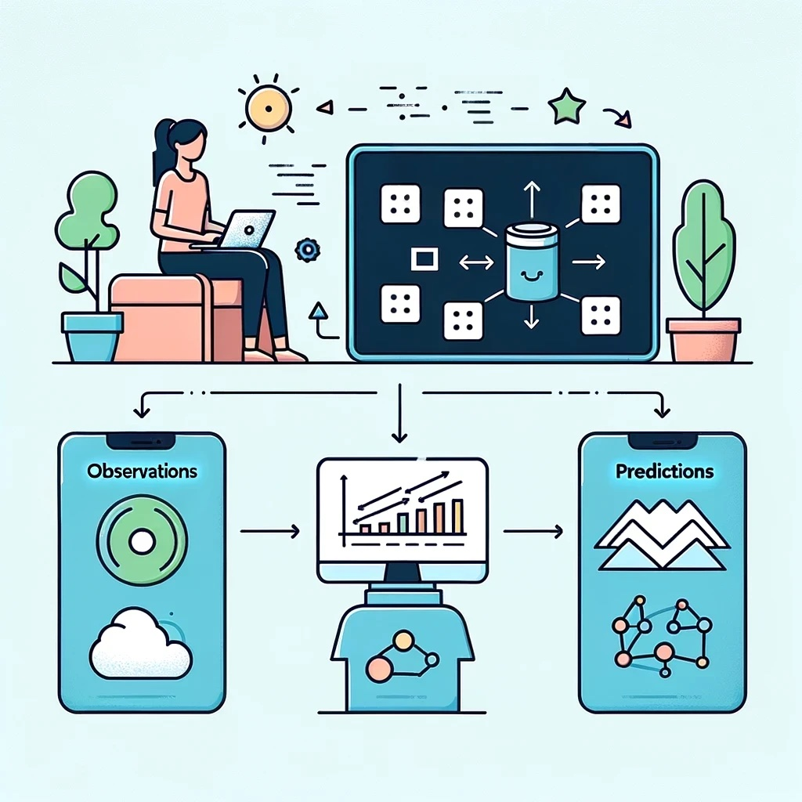

## Introduction

Welcome to the Vocab Victor Partner Zone! Empower your language learning applications with our innovative learner model. 
> A learner model is a description of the student’s knowledge and, in the context of intelligent tutoring, its main goal is to guide pedagogical decision-making. -Trude Heift 

By integrating our technology, your learners will benefit from adaptive and personalized learning experiences, significantly enhancing their engagement and outcomes.

## How it works

### Log your learners' activity

Use our API to log all vocabulary interactions. (Our excellent documentation and concierge-level customer support will get you set up!)

### Customize your activity types

Different language learning apps target different types of language learning, from passive reading to free production. We define each of these learnings as an *activity type*, which is associated with an observation.

Some example activity types: 
- Learner picks the correct L1 translation for a target word
- Learner uses the word in a sentence
- Learner produces the word in a puzzle game

Each learner observation is associated with a specific activity type.

### Our analytics engine takes over

Vocab Victor Zone's analytics engine examines the learner's interactions with words and creates a predictive model of the learner's vocabulary knowledge. 

### Adaptive learning model

Our learner model adapts to each user's unique learning progress, dynamically adjusting to provide personalized recommendations. This continuous adaptation ensures that learners receive the most effective instruction tailored to their current needs.

### Personalized learning with zone words

Our vocabulary learner model pinpoints the *zone of proximal development* (ZPD) for each learner, offering the next, best words for every activity type in your app. These "zone words" are just beyond the learner's current vocabulary level, ensuring they learn new words in an engaging, yet challenging way.

Once the model is created, you can query to API for zone words that are appropriate for each learner's desired activity type.

## Why it's good

### Use an out-of-the box learner model

Designing and implementing a sophisticated learner model for your app is necessary - but difficult! We offer a learner model that is:

- Designed based on the latest research in language acquisition
- Implemented using a well-documented API's straightforward hooks
- Maintained by ... not your team!

### Enhanced user retention

Remember *Goldilocks and the Three Bears*? Our model gives you words at the sweet spot of "not too hard" and "not too easy." This balance keeps learners engaged and motivated, reducing the risk of dropout and improving overall retention.

## A unified learning journey

Vocab Victor stands out by allowing learners to connect multiple language learning apps to provide a unified learning journey for vocabulary. 

Imagine a learner who uses three different apps, each with a different activity type. Because vocabulary learning is an incremental process, each activity adds to the learner's knowledge. For example, consider this sequence:

- A learner reads a passage, and notices a new word. They may guess at the word's meaning through context, or click on it to see the definition. Now the word is in their ZPD for further meaning exposure and engagement.
- Later, the learner engages with that same word in a matching activity, word game, or multiple choice test. With each such engagement, their knowledge for the word is reinforced and advanced. This pushes the word into the ZPD for more active engagement.
- Finally, an activity to elicit production is presented, giving the learner a framework to use the word in a sentence or conversation. In vocabulary acquisition, passive knowledge precedes active knowledge. This is an example of why each activity type has its own model and set of zone words.

Because Vocab Victor Zone lets learners follow their progress across different learning tools, Vocab Victor zone passes off vocabulary like a baton in a relay race. Each app has different strengths, letting the learner experience on a seamless learning journey!

### Comprehensive tracking and analytics

With detailed tracking and analytics, you can gain deep insights into each learner's progress. This data-driven approach allows educators and developers to understand learner behavior and make informed decisions to enhance the learning experience.

### Privacy and Security

We offer both private and open models to accommodate your privacy preferences. Our system ensures that all learner data is handled with the utmost security and privacy. You can choose to keep your data isolated or allow it to be shared in an anonymized, aggregate format to improve the overall model.

### Easy Integration and Scalability

Our well-documented API and robust support make it easy to integrate Vocab Victor into your existing applications. Designed to scale with your needs, our infrastructure supports a wide range of user loads, ensuring optimal performance for your application.

## Technical Overview

### Architecture

Our system is built on Google Cloud services, which gives a scalable and resilient architecture, designed to handle high volumes of data and user interactions. The architecture ensures uptime and reliability, critical for any educational application.

### Model Creation

Our learner model is crafted using advanced machine learning techniques, ensuring accuracy and adaptability. The model continuously learns from user interactions, improving over time to provide better recommendations and insights.

### Data Security

We prioritize data security, implementing stringent measures to protect user information. Our platform complies with all relevant data protection regulations, ensuring that your users' data is safe and secure.

## Get Started Today

Partnering with Vocab Victor opens up new opportunities for enhancing your language learning applications. With our cutting-edge technology, you can offer a superior learning experience that drives user satisfaction and success.

## Frequently asked questions

### Why vocabulary?

Vocabulary knowledge is integral to foreign language knowledge, and necessary to excell in all four language skills - reading, writing, speaking, and listening. Also, activities involving vocabulary are easier to encode computationally, compared to grammatical structures.

## Contact Us

Ready to integrate Vocab Victor into your applications? Contact us today to learn more about our partnership opportunities and how we can help you transform language learning for your users.

## Suggestions for Graphics

1. **Personalized Learning Visualization**: A graphic showing how the learner model adapts to different users.
2. **Vocabulary Coverage Chart**: A visual representation of the extensive vocabulary database.
3. **Real-Time Feedback Interaction**: An illustration or screenshot of the real-time feedback feature in action.
4. **Analytics Dashboard**: A snapshot of the detailed analytics dashboard, highlighting key metrics.
5. **Integration Process Flow**: A simple flowchart showing the ease of integrating Vocab Victor into existing applications.
6. **Unified Learning Journey Example**: An infographic demonstrating how Vocab Victor connects data from multiple language learning apps to create a cohesive learning path.

<Note>
### Hero Image Suggestion

For the hero image, consider an engaging visual that combines the following elements:

1. **Learner Engagement**: A diverse group of learners using various devices (tablets, smartphones, laptops) to study language.
2. **Personalization**: Visual cues like progress bars, adaptive learning paths, or personalized dashboards that showcase the tailored learning experience.
3. **Technology Integration**: A background that subtly integrates icons or symbols representing technology, connectivity, and data (like network lines, graphs, or cloud symbols).
</Note>
