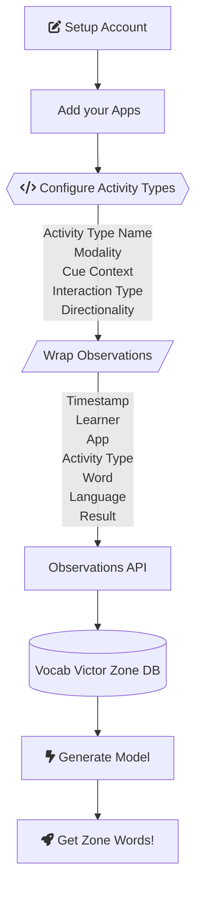

The Vocab Victor Zone API is a powerful tool that allows you to create a learning model for the users of your language learning app. This model is based on the learner's interactions with your app and the data you provide to the API. The API uses this data to generate a personalized set of words for each learner, based on their learning patterns.

## Overall process

## Components

The Vocab Victor Zone API consists of several components that work together to create a learner model. These components include:

- [**Activity Types**](/activity-types): These are the different types of activities that your apps offer to learners. Each activity type has a set of tags which together provide a linguistic-informed taxonomy of the interaction across multiple dimensions. The Vocab Victor team will help you define activity types for your app that capture the nuances of vocabulary acquisition across multiple interactions with a word.
- [**Observations**](/log-observations): These are the time-stamped interactions each user has with the words in your app. Each observation is linked to an associated activity type. It is critial to log each and every interaction your users have with a vocabulary item. For example, if a user reads a passage, each word in the passage should be logged as an observation. If the user clicks on a word to see its definition, that should be logged as an observation as well.
- [**Learners**](/learner-tracking): 
- **Model**: These are the learning models that the API generates for your app. Each model is associated with a different activity type. The model is based on an analysis of all of your app's observations.
- **Zone Words**: These are the words that the API generates for each learner, for each activity type in your app, based on the learner's patterns. (In the case of a new user, or where scant data is available for a learner, cohort averages are used to fill in the predictions.) The API uses the learner model to determine which words are most beneficial for the learner to engage with next in a given activity type.

## How it works

Magic! Just kidding, it's math. The Vocab Victor Zone model uses a combination of statistics, measurement algorithms, machine learning, and computational linguistics to analyze the observations and generate a learner model. The API uses this model to predict the best words for each learner to engage with next, based on their learning patterns. The Vocab Victor team is continually iterating on the models to improve their accuracy and effectiveness for your users.
